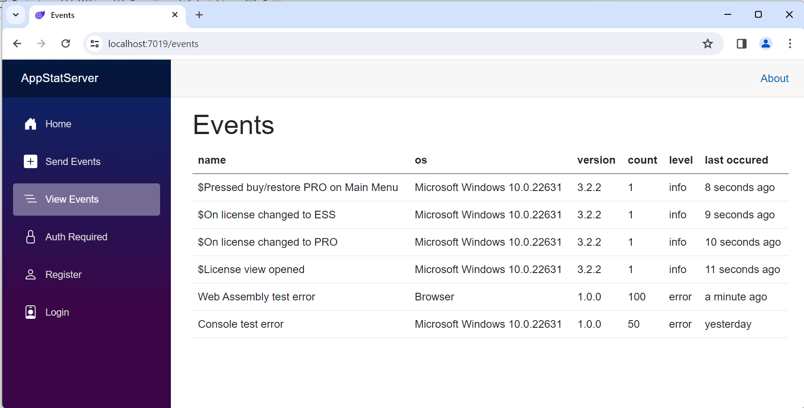

# AppStatServer
Senry sdk compatible dotnet core server to gather app events and crashes
using dotnet 8, entity framework and blazor web

inspired by glitchtip.com project

current status: proof of concept
