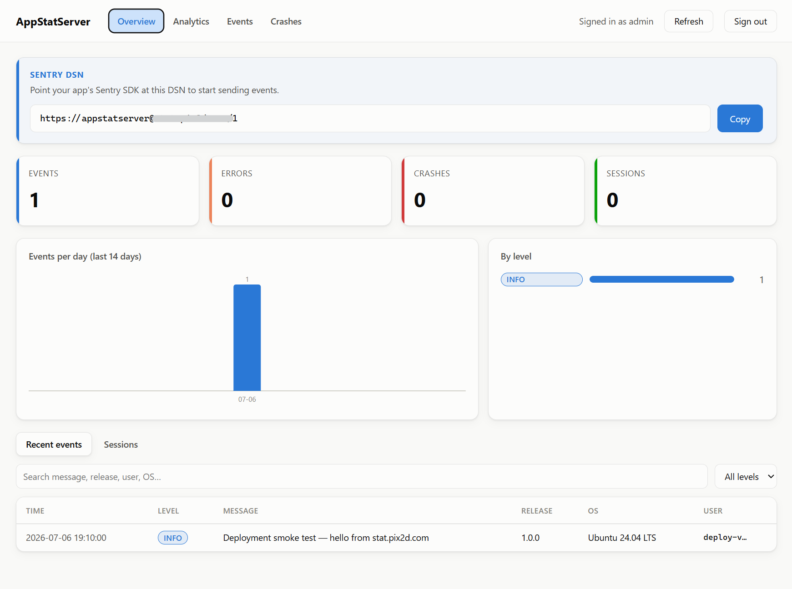

# AppStatServer

A Sentry SDK–compatible .NET server that ingests application events and crashes.
Apps point their Sentry SDK at this server, and it parses the envelopes into events
and sessions and stores them.

Inspired by the [glitchtip.com](https://glitchtip.com) project.

> Current status: proof of concept. Testing on production.



## What it does

- Accepts Sentry envelopes on `POST /api/1/envelope` (gzip aware).
- Parses event and session entries, extracting message, level, release, stacktrace,
  trace/span ids, OS and user info.
- Persists everything to an embedded [LiteDB](https://www.litedb.org/) database — no
  external database required.
- Serves a built-in web dashboard behind a cookie login, with AppCenter-style pages:
  - **Overview** — stat cards, events-per-day chart, level breakdown, recent events & sessions.
  - **Analytics** — active & new users over 7/14/30/90 days, MAU/WAU/DAU, sessions per
    day, session-duration histogram, active users by app version, OS distribution and
    top devices, plus retention: D1/D7/D30 return rates and a weekly cohort table.
  - **Funnels** — saved conversion funnels over the custom events: pick 2–10 event names
    in order, and the report counts users who passed each step *after* the previous one
    (per-step and overall conversion %).
  - **Events** — all non-crash events grouped by message (count / affected users / last
    seen), filterable by app version and OS.
  - **Crashes** — AppCenter-style diagnostics: crashes-per-day and errors-per-day charts,
    plus one combined table of crash and handled-error signatures, filterable by app
    version, with per-issue resolve/reopen (a resolved issue reopens if it recurs).

### Endpoints

| Method | Route                | Auth   | Description                          |
|--------|----------------------|--------|--------------------------------------|
| POST   | `/api/1/envelope`    | none   | Ingest a Sentry envelope             |
| GET    | `/`                  | cookie | Dashboard SPA (redirects to login)   |
| POST   | `/login`             | none   | Sign in (`{ "username", "password" }`) → sets cookie |
| POST   | `/logout`            | none   | Clear the session cookie             |
| GET    | `/api/me`            | cookie | Current signed-in user               |
| GET    | `/api/events`        | cookie | Last 100 events                      |
| GET    | `/api/events/{id}`   | cookie | A single event by id                 |
| GET    | `/api/sessions`      | cookie | Last 100 sessions                    |
| GET    | `/api/stats`         | cookie | Aggregated counts for the Overview   |
| GET    | `/api/analytics?days=` | cookie | Usage analytics over a window (days 1–90, default 30) |
| GET    | `/api/retention?weeks=` | cookie | D1/D7/D30 retention + weekly cohort table (weeks 2–26, default 8) |
| GET    | `/api/funnels`       | cookie | Saved conversion funnels                |
| POST   | `/api/funnels`       | cookie | Create a funnel (`{ "name", "steps": ["a","b",…] }`, 2–10 steps) |
| DELETE | `/api/funnels/{id}`  | cookie | Delete a funnel                         |
| GET    | `/api/funnels/{id}/report?days=` | cookie | Per-step users and conversion % over a window |
| GET    | `/api/event-groups?release=&os=` | cookie | Non-crash events grouped by message (optional version/OS filter) |
| GET    | `/api/crash-groups?release=&os=` | cookie | Crashes grouped by signature (optional version/OS filter) |
| GET    | `/api/diagnostics?days=&release=` | cookie | Crashes + handled errors: per-day series and grouped signatures with resolution state (days 1–90, optional version filter) |
| POST   | `/api/resolve`       | cookie | Mark a crash/error group resolved or reopen it (`{ "key", "resolved" }`) |
| GET    | `/api/facets`        | cookie | Distinct releases & OSes for the filter dropdowns |
| GET    | `/api/maintenance/purge-preview?olderThanDays=` | cookie | What a purge would remove: counts and logical bytes |
| POST   | `/api/maintenance/purge` | cookie | Delete raw records older than a cutoff (`{ "olderThanDays": 90 }`, 7–3650) |
| POST   | `/api/maintenance/compact` | cookie | Rebuild the LiteDB file to reclaim freed pages |
| POST   | `/mcp`               | bearer | MCP (Streamable HTTP) server for agents — disabled unless `Mcp__Token` is set |

The dashboard is a single protected page with client-side routing
(`#/overview`, `#/analytics`, `#/events`, `#/funnels`, `#/crashes`); its data comes from
the `/api/*` endpoints above.

The ingest endpoint stays open — SDKs authenticate with their DSN, not the dashboard
cookie. Everything under `/api/*` and the dashboard page require a login.

### Authentication

A single set of credentials comes from configuration and can be overridden with
environment variables (double-underscore syntax):

```bash
Auth__Username=admin
Auth__Password=your-strong-password
```

The default in `appsettings.json` is `admin` / `changeme` so the app runs out of the
box; the server logs a warning while the default password is in use. **Override
`Auth__Password` before any real deployment.**

## MCP server (fix crashes from your editor)

The server can expose its live diagnostics to an MCP client (e.g. Claude Code) so an agent
can pull the *actual* crashes and handled errors and fix them in the codebase. It is served
over the Streamable HTTP transport at `POST /mcp` and reads the same data as the dashboard.

It is **opt-in and guarded by a static bearer token** — the `/mcp` route is not mapped at all
unless a token is configured:

```bash
Mcp__Token=a-long-random-secret
```

Tools:

| Tool             | What it does |
|------------------|--------------|
| `list_diagnostics` | Open crash/error signatures ranked by occurrence count (filter by `days`, `release`, `kind`, `includeResolved`). |
| `get_issue`        | Full detail of one signature by its `key`, including the stack trace of the latest occurrence. |
| `resolve_issue`    | Mark a signature resolved (or reopen it) — it auto-reopens if the same crash recurs. |

The dashboard's **Crashes** page has a **Connect MCP** button that shows the endpoint URL,
the access token, and a ready-to-paste `.mcp.json` for whatever host you reached it on.

Point Claude Code at it with a `.mcp.json` (a template lives at the repo root — set the two
env vars, don't commit the token):

```json
{
  "mcpServers": {
    "appstat": {
      "type": "http",
      "url": "${APPSTAT_MCP_URL}",
      "headers": { "Authorization": "Bearer ${APPSTAT_MCP_TOKEN}" }
    }
  }
}
```

Typical loop: `list_diagnostics` → `get_issue` on the worst one → fix the code → deploy →
`resolve_issue`.

## Website snippet (count visitors next to your app's analytics)

The server ships an embeddable tracker at `/track.js` (~1 KB, no cookies, no third
parties). Paste it into your site's `<head>` — the dashboard shows the full instructions
with your host filled in under **Maintenance → Website tracking** (and behind the
**Events → Connect website** button):

```html
<script async src="https://your-appstat-host/track.js" data-release="website@1.0.0"></script>
```

It assigns the visitor a stable anonymous id (localStorage) and sends to `POST /api/track`:

- `site_visit` on every page view — with the page path, the external referrer host and
  any `utm_source` / `utm_medium` / `utm_campaign` query tags, so campaign traffic is
  attributable;
- `site_click` for any element carrying `data-track`, e.g.
  `<a href="/download" data-track="download_button">Download</a>`;
- anything else via `appstat.track("name", { any: "props" })`.

Combine it with a funnel like `site_visit → site_click` to see what share of site
visitors head for the download, and compare that with the app's new-user counts on the
Analytics page. The events show up under **Events** bucketed as the *Web* platform.

## Tech stack

- .NET 10, ASP.NET Core Minimal API (`WebApplication.CreateSlimBuilder`)
- LiteDB for storage
- TUnit for tests

## Repository layout

```
AppStatServer.slnx              # solution (slnx format)
src/AppStatServer/          # the server
tests/AppStatServer.Tests/  # TUnit tests
samples/ConsoleTestClient/      # console app that emits Sentry events for manual testing
```

## Getting started

```bash
# build everything
dotnet build AppStatServer.slnx

# run the server (listens on http://localhost:5012)
dotnet run --project src/AppStatServer

# run the tests (Microsoft.Testing.Platform mode, enabled via global.json)
dotnet test --solution AppStatServer.slnx
```

To generate some traffic, run the sample client against a running server:

```bash
dotnet run --project samples/ConsoleTestClient
```

Then open the dashboard at `http://localhost:5012/` and sign in (default `admin` /
`changeme`) to inspect the collected events and sessions.
